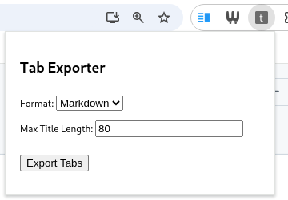

**EDIT 2024-12-19:** The extension now supports Firefox as well.

I have an unhealthy habit of opening too many tabs.
You can organize them whichever way you want, but, by the time you reach a couple of hundred, chances are you won't ever dig yourself out of the hole.
I have a workaround, which is similar to the method I use on my INBOX: periodically getting rid of them all (apologies to all of you to whom I owe an email, and who will never receive a reply).
Clearing tabs typically comes in one of two forms: switching browsers, or running the excellent [One Tab extension](https://www.one-tab.com/).

One Tab pretty much covers my use case—it collates tabs into a single page, from where you can close tabs, open sets of tabs, etc.
But I thought it would be neat to **export a plain text list** of all of my tabs, **in org-mode or markdown format**.
That way, I can store it in my [daily organization system](https://orgmode.org/), and efficiently filter through the URLs in my [text editor](https://www.gnu.org/software/emacs/).

After some bumbling around, I realized that the SNSS files stored
under `~/.config/chromium/Default/Sessions/`, while perhaps containing
the information I need, would not yield easily.

The Chrome API looked promising, but cannot be accessed outside of
extensions. Therefore, we wrote an extension.

## The Extension

Turns out extensions are pretty easy to construct under Chrome / Chromium.
You need a `manifest.json` file with some meta-data, which points to an HTML popup to show when the user clicks on the extension button.
And in the background, you can run a "service worker", which responds to events generated in the popup.

Here's our manifest:

```json
{
  "manifest_version": 3,
  "name": "tabs2text",
  "description": "Export list of open tabs as markdown / org text",
  "version": "0.1",
  "permissions": ["tabs", "tabGroups", "downloads"],
  "action": {
    "default_popup": "popup.html"
  },
  "background": {
    "service_worker": "service-worker.js"
  }
}
```

[The popup](https://github.com/stefanv/tabs2text/blob/main/popup.html) is some simple HTML to display a form which asks: do you want to download the file in org or markdown format?
What is the maximum title length?
And a button, that you click to start the show:



The [service worker](https://github.com/stefanv/tabs2text/blob/main/service-worker.js) does the bulk of the work: it iterates over the windows and tabs, and constructs an org or markdown-formatted string.
For markdown, it would look something like this:

```js
const windows = await chrome.windows.getAll({populate: true});

for (let [windowIndex, window] of windows.entries()) {
  let content = '';

  window.tabs.forEach(tab => {
    content += `- [${tab.title}](${tab.url})`;
  }
}
```

Then, there's some footwork to add headings, and to handle tab groups.

Finally, we take the string and bundle it as a file download:

```js
const mimeType = (format === 'markdown') ? 'text/markdown' : 'text/org';
const dataUrl = `data:${mimeType};charset=utf-8,${encodeURIComponent(content)}`;
const filename = `tabs-export.${format === 'markdown' ? 'md' : 'org'}`;

await chrome.downloads.download({
  url: dataUrl,
  filename: filename,
  saveAs: true
});
```

The full source code is available at: https://github.com/stefanv/tabs2text

## Installing the extension

Obviously, you should not run an extension by a stranger (me!) without [reading the code](https://github.com/stefanv/tabs2text).
Once you're satisfied that it does what it's supposed to, here are the steps for installing the extension:

1. Clone or download [the repository](https://github.com/stefanv/tabs2text).
2. In Chrome, navigate to Extensions -> Manage Extensions, and toggle the "Developer Mode" button at the top right.
3. Click "Load unpacked", and select the `chrome` folder in the repository directory from (1).
4. `tabs2text` should now be visible under the list of extensions (typically a little puzzle piece in the top bar).

Enjoy, and file a pull request if you make improvements!
